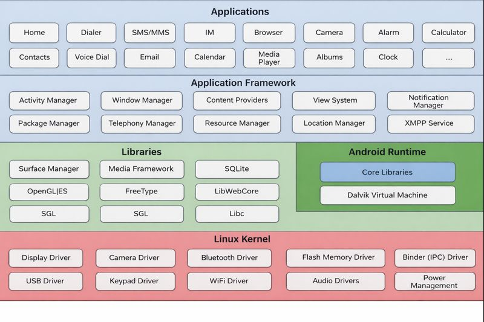

<div align="center">
  <h2>Android Basics</h2>
</div>

> You can go through this page to know android better https://www.tutorialspoint.com/android/index.htm

## What is Android ?

In short, Android is a mobile operating system (OS) developed by Google. It is designed primarily for touchscreen devices like smartphones and tablets, but it also powers watches, TVs, and cars.

## Android OS Architecture

>Android operating system is a stack of software components which is roughly divided into five sections and four main layers as shown below in the architecture diagram.

<div align="center">
  
</div>

### 2 Key Things to Know:
- **Open Source:** Many different companies (like Samsung, Xiaomi, and OnePlus) can use it and customize it for their own devices.

- **[Linux kernel]()**
  - At the bottom of the layers android uses the Linux kernel. This provides a level of abstraction between the device hardware and it contains all the essential hardware drivers like camera, keypad, display etc. 
- **Libraries**
  - On top of Linux kernel there is a set of libraries including open-source Web browser engine WebKit, well known library libc, SQLite database which is a useful repository for storage and sharing of application data, libraries to play and record audio and video, SSL libraries responsible for Internet security etc.
- **Android Libraries**
  - This category encompasses those Java-based libraries that are specific to Android development. Examples of libraries in this category include the application framework libraries in addition to those that facilitate user interface building, graphics drawing and database access. A summary of some key core Android libraries available to the Android developer is as follows:

| Library | Description |
|---|---|
| android.app | Provides access to the application model and is the cornerstone of all Android applications. 
| android.content | Facilitates content access, publishing and messaging between applications and application components. 
| android.database | Used to access data published by content providers and includes SQLite database management classes. 
| android.opengl | A Java interface to the OpenGL ES 3D graphics rendering API.
| android.os | Provides applications with access to standard operating system services including messages, system services and inter-process communication.
| android.text | Used to render and manipulate text on a device display.
| android.view | The fundamental building blocks of application user interfaces.
| android.widget | A rich collection of pre-built user interface components such as buttons, labels, list views, layout managers, radio buttons etc.
| android.webkit | A set of classes intended to allow web-browsing capabilities to be built into applications. 
- **Android Runtime**
  - This is the third section of the architecture and available on the second layer from the bottom. This section provides a key component called **Dalvik Virtual Machine** which is a kind of Java Virtual Machine specially designed and optimized for Android.

  - The Dalvik VM makes use of Linux core features like memory management and multi-threading, which is intrinsic in the Java language. The Dalvik VM enables every Android application to run in its own process, with its own instance of the Dalvik virtual machine. (Dalvik VM is a outdated tech used till version 5.0)
---
<details>
<summary><b>Is Dalvik still relevant today?(NO)</b></summary>
Technically, no—you won't find the Dalvik VM running on any modern smartphone. However, the name lives on in two ways:

Bytecode Format: Android apps are still compiled into .dex files (Dalvik Executable). Even though ART is the "engine," it still reads the Dalvik-style instructions.

User Agent Strings: You might still see the word "Dalvik" in technical logs or "User Agent" strings when an app connects to a server. This is often kept for backward compatibility so older web servers don't crash when they see a "new" type of device.
</details>

---
  - The Android runtime also provides a set of core libraries which enable Android application developers to write Android applications using standard Java programming language. 

### ART vs Dalvik

- Dalvik used JIT (Just-in-Time) compilation.
- ART uses AOT (Ahead-of-Time) and JIT, making apps faster and more battery-efficient.

- **Application Framework**
  - The Application Framework layer provides many higher-level services to applications in the form of Java classes. Application developers are allowed to make use of these services in their applications.

  - The Android framework includes the following key services −

|| Description |
|---|---|
| Activity Manager | Controls all aspects of the application lifecycle and activity stack.
| Content Providers | Allows applications to publish and share data with other applications.
| Resource Manager | Provides access to non-code embedded resources such as strings, color settings and user interface layouts.
| Notifications Manager | Allows applications to display alerts and notifications to the user.
| View System | An extensible set of views used to create application user interfaces. 
---

## Android OS file system structure

```yml
/                       # Root of the Android filesystem
├── /system             # Core Android OS (framework, system apps, libraries)
│   ├── /app             # Pre-installed system apps (non-privileged)
│   ├── /priv-app        # Privileged system apps (higher permissions)
│   ├── /bin             # Essential system binaries (toybox, toolbox)
│   ├── /etc             # System-wide configuration files
│   ├── /framework       # Android framework JARs (services, APIs)
│   ├── /lib             # Native libraries (32-bit)
│   ├── /lib64           # Native libraries (64-bit)
│   └── /xbin            # Additional binaries (legacy location)
│
├── /vendor              # OEM / chipset-specific files (HALs, drivers)
│   ├── /bin             # Vendor binaries
│   ├── /etc             # Vendor configuration files
│   ├── /lib             # Vendor native libraries (32-bit)
│   └── /lib64           # Vendor native libraries (64-bit)
│
├── /product             # Device-specific system features (Android 10+)
│   ├── /app             # Product apps
│   ├── /priv-app        # Product privileged apps
│   └── /etc             # Product configuration overlays
│
├── /data                # User data & installed apps (read-write)
│   ├── /app             # Installed user & third-party APKs
│   ├── /data            # App private data directories
│   ├── /user            # Multi-user data storage
│   └── /media           # Internal storage (/sdcard)
│
├── /sdcard              # User-accessible internal storage (symlink)
│
├── /cache               # Temporary system & OTA update files
│
├── /boot                # Kernel and ramdisk (not normally accessible)
│
├── /dev                 # Device files (sockets, block devices)
│
├── /proc                # Kernel & process info (virtual filesystem)
│
├── /sys                 # Kernel runtime configuration (sysfs)
│
├── /apex                # Modular system components (Android 10+)
│   └── /com.android.*   # Runtime, media, crypto, etc. modules
│
├── /mnt                 # Mount points for storage devices
│
├── /storage             # External & emulated storage locations
│
├── /odm                 # ODM (Original Design Manufacturer) files
│
├── /metadata            # Encryption & verified boot metadata
│
└── /efs                 # Radio, IMEI, modem-related sensitive data
```

- App binaries → `/data/app/`
- App private data → `/data/data/<package>/`
- System APKs → `/system/app/`,` /system/priv-app/`
- Native `.so` files →` /system/lib64/`, `/vendor/lib64/`
- Framework logic → `/system/framework/`
- SELinux / policies → `/system/etc/`, `/vendor/etc/`
- Sensitive device IDs → `/efs/` ⚠️

### Access Notes
| Directory       | Root Needed                     |
| --------------- | ------------------------------- |
| `/system`       | ❌ (read-only on modern Android) |
| `/vendor`       | ❌                               |
| `/data/data/*`  | ✅                               |
| `/proc`, `/sys` | Partial                         |
| `/efs`          | ✅ (highly sensitive)            |

---

## What is an android App ?

An Android app is a software program designed specifically to run on the Android operating system.

## Android App File Formats

> *Android uses 2 file formats APK & AAB*

### How AAB Works: The "Kitchen" Analogy
To understand the difference between an APK and an AAB, imagine ordering a pizza:

- **APK (The Pre-Packaged Pizza):** You get a frozen pizza that has every possible topping on it (peppers, olives, pepperoni). Even if you only like pepperoni, you have to carry the weight of all the other toppings.

- **AAB (The Chef’s Kitchen):** You send the "recipe and ingredients" (AAB) to Google Play. When a user "orders" the app, Google looks at their phone and "cooks" a custom pizza with only the toppings that phone needs.

### Key Differences at a Glance

| Feature | APK (Android Package) | AAB (Android App Bundle) |
|---|---|---|
| Usage | Direct installation on phones. | Uploading to Google Play Store. |
| Size | Larger (contains files for all devices). | Smaller (tailored to your device). |
| Installation | Can be "sideloaded" easily. | Cannot be installed directly; must be converted to an APK first. |
| Requirement | Optional/Legacy. | Mandatory for new apps on Google Play since 2021. |

>You cannot manually install an .aab file on your phone like you can with an .apk. If you download an AAB file from the internet, you would need a special tool (like Google’s bundletool) to convert it into an installable format.

### Common Types of Apps

| Type | Examples | What they do |
|------|----------|--------------|
| System Apps | Settings, Phone, Camera | Core functions that come pre-installed. |
| Native Apps | WhatsApp, Instagram | Built specifically for Android for the best performance. |
| Web Apps | Chrome, Lite versions | Basically websites that look and act like apps. |

---
## APK

- **The File Format:** Every Android app is bundled into a single file called an APK (Android Package).
- It’s similar to a `.exe` file on Windows or a `.zip` file it contains all the code, images, and instructions the phone needs to install the app.
- **Languages:** Developers usually write these apps using programming languages like **Kotlin** or **Java**
- **Distribution:** Most apps are downloaded through the **Google Play Store**, but because Android is open, you can also get them from other places like the Amazon Appstore or by "sideloading" an APK directly from a website.

> Every APK = a ZIP file with logic split across layers.

---

## AAB

An **AAB (Android App Bundle)** is the official publishing format for Android apps. Introduced by Google in 2018, it has since replaced the traditional APK as the standard format for uploading apps to the **Google Play Store**.

While an APK is a "finished" package that you install directly, an AAB is a publishing artifact; think of it as a "master file" that contains everything the app needs, which Google then uses to build a custom version just for your specific phone.

### AAB features

- Smaller Downloads: Because Google only sends the code and images that fit your specific device (e.g., only English text and high-resolution images for a 4K screen), apps are typically 15% to 35% smaller than traditional APKs.

- Dynamic Features: AAB allows for "on-demand" modules. For example, a heavy "Level 2" of a game might only download once you actually finish Level 1, keeping the initial install very fast.


- Automatic Optimization: Developers don't have to manually create different versions of their app for different types of phone processors; Google handles all the technical splitting automatically.

- Security: AAB uses Google Play App Signing, meaning Google manages the security keys. If a developer loses their private key, Google can help them recover it—something that was impossible with old-school APKs

---

## App Architecture

<div align="center">
 
</div>

**1. UI Layer (View & ViewModel)**
- **UI Elements:** The activities and fragments that render the data on the screen (the "View").

- **State Holders (ViewModel):** These hold the data needed for the UI and handle the logic for user interactions. They survive configuration changes (like rotating the phone).

**2. Domain Layer (Optional)**
- This sits between the UI and Data layers. It contains **Use Cases** that encapsulate complex business logic. This keeps the ViewModel simple and allows logic to be reused across different parts of the app.

**3. Data Layer (Repository & Data Sources)**
- **Repository:** The "single source of truth." It decides whether to fetch data from a local database or a remote network.

- **Data Sources:** * **Local:** Usually a **Room** database or DataStore.
  - **Remote:** A web service or API (usually handled via **Retrofit**).

## Key Principles
- **Separation of Concerns:** Each layer has a specific job and doesn't interfere with the others.

- **Unidirectional Data Flow (UDF):** Data flows up (from the data source to the UI), and user events flow down (from the UI to the data source).

- **Reactive UI:** The UI "observes" changes in the data using tools like **StateFlow** or **LiveData**, so it updates automatically whenever the data changes.

---

## **Android app file architecture**

In Android Studio, the "file architecture" refers to how your project is organized on your computer. When you look at an Android project, it is typically viewed in two ways: the **Android View** (organized by function) and the **Project View** (the actual folder hierarchy on your disk).

### 1. The Core App Structure (Android View)
This is the view most developers use. It hides complex system files to focus on the things you edit every day.

```yml
app/
├── manifests/
│   └── AndroidManifest.xml      # The app's "identity card": lists permissions, app name, and screens.
├── java/ (or kotlin/)
│   ├── com.example.myapp/       # Your main package containing source code.
│   │   └── MainActivity.kt      # The entry point: the first screen that opens.
│   ├── com.example.myapp (test) # Unit tests for business logic.
│   └── com.example.myapp (androidTest) # UI tests that run on a device.
├── res/                         # All non-code resources.
│   ├── drawable/                # Images, icons, and vector graphics.
│   ├── layout/                  # UI design files (e.g., activity_main.xml).
│   ├── mipmap/                  # App launcher icons for different screen densities.
│   └── values/                  # Text, color, and style definitions.
│       ├── colors.xml           # App color palette.
│       ├── strings.xml          # All text used in the app (for easy translation).
│       └── themes.xml           # Overall look and feel (Dark/Light mode).
└── Gradle Scripts/
    ├── build.gradle (Project)   # Configuration applied to the entire project.
    ├── build.gradle (Module: :app) # Where you add libraries and set the version (e.g., v1.0).
    └── local.properties         # Path to your Android SDK (private to your PC).
```
### Key File Deep-Dive

* **`AndroidManifest.xml`**: Every app must have this file in its root. It tells the Android system which permissions to ask the user for (e.g., **Camera**, **GPS**) and which screen to launch when the app icon is tapped.
* **`res/layout/`**: These files use XML to define where buttons and images sit on the screen. In modern apps, this is increasingly being replaced or supplemented by **Jetpack Compose** code within the `java/kotlin` folder.
* **`res/values/strings.xml`**: Instead of "hard-coding" text like `button.text = "Submit"`, you save it here. This allows you to easily translate your app into multiple languages by simply adding a new `strings.xml` for each language.

---

### 2. The Physical File Structure (Project View)
If you look at the actual folders on your computer, the hierarchy looks like this:

```yml
ProjectRoot/
├── app/                        # Contains the actual code and resources for your application.
│   ├── src/                    # All source code files.
│   │   ├── main/               # The production code.
│   │   │   ├── java/           # Your logic code (Java or Kotlin files).
│   │   │   ├── kotlin/         # Your logic code (if using Kotlin exclusively).
│   │   │   ├── res/            # Your UI assets (layouts, images, strings).
│   │   │   └── AndroidManifest.xml  # The app manifest (permissions, app components).
│   │   ├── test/               # Unit tests for logic (runs on your computer).
│   │   └── androidTest/        # Tests that run on a physical phone or emulator.
│   ├── build.gradle            # Build configuration specific to the 'app' module.
│   └── proguard-rules.pro      # Rules for shrinking and obfuscating code.
├── build/                      # Temporary files created when you "build" or "run" the app.
├── gradle/                     # Files for the build system that automates compiling your code.
├── .gitignore                  # Files and folders to be ignored by Version Control (Git).
├── build.gradle                # Project-wide build configuration.
├── gradle.properties           # Project-wide Gradle settings.
├── gradlew                     # Gradle wrapper script for Unix-based systems.
├── gradlew.bat                 # Gradle wrapper script for Windows.
└── settings.gradle             # Tells Android Studio which modules are part of the project.
```
### Why this structure matters:

* **Separation of Testing:** By keeping `test` (Local Unit Tests) separate from `androidTest` (Instrumented Tests), you can run logic tests quickly on your PC without needing a device attached.
* **The `main` Folder:** This is where 99% of your development happens. Any file inside `main` ends up in the final app that users download.
* **The `res` Folder:** It is strictly organized into subfolders like `layout/` for UI and `drawable/` for images, which the Android system uses to automatically choose the right assets for different screen sizes.

### Compiled APK file structure

```yml
app.apk
├── AndroidManifest.xml        # App blueprint: permissions, components, exported entry points
├── classes.dex                # Main compiled Java/Kotlin logic (business rules, API calls)
├── classes2.dex               # Extra compiled logic when app exceeds DEX method limit
├── classes3.dex               # Additional compiled code for very large apps
├── resources.arsc             # Compiled resource table (strings, IDs, feature names)
├── res/                       # App resources used by the UI and config
│   ├── layout/                # UI screen layouts (activities, dialogs)
│   ├── drawable/              # Images, icons, vectors
│   ├── values/                # Strings, colors, styles, feature flags
│   └── xml/                   # XML configs (network security, providers, backups)
├── assets/                    # Raw bundled files (often secrets, configs, WebView files)
│   ├── config.json            # App configuration (sometimes API keys or endpoints)
│   ├── cert.pem               # Embedded certificate (pinning / crypto related)
│   └── www/                   # WebView HTML/JS/CSS files (XSS & logic bugs)
├── lib/                       # Native libraries (NDK code)
│   ├── arm64-v8a/             # Native binaries for ARM64 devices
│   │   └── libnative.so       # Native code (SSL pinning, crypto, obfuscation)
│   ├── armeabi-v7a/           # Native binaries for 32-bit ARM
│   └── x86_64/                # Native binaries for emulators / x86 devices
├── META-INF/                  # APK signing and integrity verification files
│   ├── MANIFEST.MF            # File hash list used for integrity checking
│   ├── CERT.SF                # Signature metadata
│   └── CERT.RSA               # Developer signing certificate
└── kotlin/
    └── Metadata               # Kotlin runtime metadata (class & function info)
```

---

## <u>Android App Components</u>


Android app components are the essential building blocks of an application. Each component is an entry point through which the system or a user can enter your app.

There are four main types of app components, each serving a distinct purpose and having its own lifecycle.

#### 1. The Four Core Components

These must be declared in your `AndroidManifest.xml` file so the OS knows they exist.

| Component | Purpose | Example |
|---|---|---|
| Activities | Represents a single screen with a user interface. It is the entry point for user interaction. | A "Login" screen or a "Settings" page. |
| Services | A general-purpose entry point for keeping an app running in the background for long-running tasks. It has no UI. | Playing music while the user is in another app or downloading data in the background. |
| Broadcast Receivers | Allows the app to respond to system-wide announcements or "broadcasts." | An app waking up when the charger is plugged in or when the battery is low. |
| Content Providers | Manages a shared set of app data that you can store in the file system, SQLite database, or web. | An app requesting access to your "Contacts" list.|

#### 2. Supporting Components
While the four above are the "pillars," these components help connect them and build the actual UI.

- **Intents:** The "glue" or messaging objects that request an action from another component (e.g., "Open the Camera Activity").

- **Fragments:** A modular portion of an Activity. It allows you to create multi-pane UIs (like a list on the left and details on the right on a tablet).

- **Views:** The UI elements drawn on the screen, such as buttons, text fields, and checkboxes.

- **Notifications:** Alerts that appear in the status bar to inform the user of events while the app is not in the foreground.

- **App Widgets:** Miniature application views that can be embedded in other applications (like the Home screen) and receive periodic updates.

---

### App Permissions

Android app permission is a rule that controls what an app is allowed to access or do on your device.

[List of permissions](permission.md)

#### Permissions & Security Model
Android uses a "**Principle of Least Privilege.**" By default, an app can only access its own files.

**The Sandboxing Model**
- **UID Segregation**: Each app is assigned a unique Linux User ID (UID). App `A` cannot "see" App `B`'s files because they belong to different "users."
  > Every app act as an user at runtime

- **SELinux:** Provides a mandatory access control layer to ensure apps only interact with the kernel and other apps in strictly defined ways.

**Permission Types**
1. **Normal Permissions:** (e.g., Internet, Bluetooth). Granted automatically at install time.

2. **Dangerous Permissions:** (e.g., Camera, Location, Contacts). Requires **Runtime Consent** (the popup you see) on Android 6.0+.

3. **Special Permissions:** (e.g., `SYSTEM_ALERT_WINDOW`). Requires the user to go deep into System Settings to enable.

#### Permission Types
- **Normal Permissions:** (e.g., Internet, Bluetooth). Granted automatically at install time.

- **Dangerous Permissions:** (e.g., Camera, Location, Contacts). Requires Runtime Consent (the popup you see) on Android 6.0+.

- **Special Permissions:** (e.g., SYSTEM_ALERT_WINDOW). Requires the user to go deep into System Settings to enable.

---

### Android App Lifecycle (The Heart of Android)
The Activity Lifecycle is a set of states an activity can be in. The system moves through these states using "callback" methods. Understanding this is critical for preventing crashes and managing memory.

<div align="center">
  
</div>

**An Activity represents a single screen. Each activity goes through well-defined states:**

| Method        | When it runs                 | Purpose                                   |
| ------------- | ---------------------------- | ----------------------------------------- |
| `onCreate()`  | Activity is first created    | Initialize UI, bind data, setup listeners |
| `onStart()`   | Activity becomes visible     | Prepare UI, register listeners            |
| `onResume()`  | Activity comes to foreground | User can interact                         |
| `onPause()`   | Activity partially hidden    | Save small state, stop animations         |
| `onStop()`    | Activity fully hidden        | Release heavy resources                   |
| `onDestroy()` | Activity removed             | Cleanup (not guaranteed)                  |

**Why it matters:** 

If you don't handle `onPause` or `onStop` correctly, your app might leak memory or drain the battery in the background. Configuration Changes (like rotating the phone) destroy and recreate the activity, triggering this entire cycle again.

---

### Storage & Data Persistence
Where does an app keep its secrets?

- **Internal Storage:** Private to the app. Located at` /data/data/com.package.name/`.
- **External Storage:** Shared space (e.g., Photos, Downloads). Since Android 10, **Scoped Storage** restricts apps so they can only see their own folders here unless granted broad access.
- **SharedPreferences:** A simple XML file used to store "Key-Value" pairs (like "IsDarkMode: True"). 
  > **Security Tip:** Never store passwords here in plain text!
- **Room/SQLite:** Structured databases for complex data.

---

### Networking & Trust
Android apps communicate primarily via HTTPS using libraries like Retrofit or OkHttp.

- **Network Security Config:** A file (`res/xml/network_security_config.xml`) that allows developers to customize network security settings.

- **Cleartext Traffic:** Modern Android (9+) blocks non-HTTPS (HTTP) traffic by default unless explicitly allowed in the manifest.

- **Certificate Pinning:** A security technique where the app "hard-codes" the server's certificate to prevent Man-in-the-Middle (MitM) attacks.
  
#### WebView Networking

- Uses app’s network rules
- Loads remote HTML/JS
- Risks:
  - XSS
  - File access
  - JavaScript bridges

---

### Build System & API Levels
Gradle is the automation tool that 

- Compiles code
- Resolves dependencies (attaches libraries, and packages)
- Builds APK/AAB
- Signs app
- Optimizes code

#### Dependencies vs Plugins
- Plugins: add build features
- Dependencies: external libraries

#### Build Variants

| Variant | Purpose             |
| ------- | ------------------- |
| debug   | Testing, debuggable |
| release | Production          |


#### Signing Configs

- Debug uses default key
- Release uses private keystore

#### ProGuard / R8

- Shrinks code
- Obfuscates classes
- Removes unused methods
- Makes reverse engineering harder

#### Android Versions & API Levels
What is an API Level?

- Numeric identifier for Android version
- **Example:**
  - Android 8 → API 26
  - Android 13 → API 33

#### Understanding SDK Versions
- **minSdkVersion:** The oldest Android version your app can run on.
- **targetSdkVersion:** The version the app was designed for. The OS uses this to decide which security behaviors to toggle (e.g., if you target API 33, Android 13 rules apply).
- **compileSdkVersion:** The version of the Android SDK used to compile the code.
  
#### Security Changes Across Versions

- Runtime permissions (6+)
- Scoped storage (10+)
- Background service limits
- Exported component enforcement (12+)

---

### Modern vs. Legacy UI
- **XML (Legacy):** Views are defined in static XML files. This is "Imperative" UI you tell the code how to change the UI.
  > Used by majority of existing apps
- **Jetpack Compose (Modern):** "Declarative" UI using Kotlin code. You describe what the UI should look like for a given state, and the framework handles the rest.